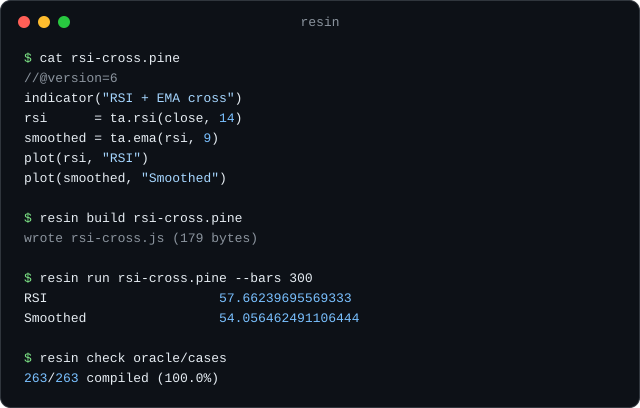

<p align="center">
  
</p>

<h1 align="center">Resin</h1>

<p align="center"><strong>在 TradingView 之外运行 Pine Script。</strong></p>

<p align="center">
  <a href="https://github.com/nullarch/resin/actions/workflows/ci.yml"></a>
  
  
  <a href="LICENSE"></a>
</p>

<p align="center">
  <a href="#quick-start">快速开始</a> ·
  <a href="API.md">库 API</a> ·
  <a href="https://www.wavealgo.com/leaderboard">线上实例：wavealgo 排行榜 ↗</a>
</p>

<p align="center">
  <a href="README.md">English</a> ·
  <strong>简体中文</strong> ·
  <a href="README.ja.md">日本語</a> ·
  <a href="README.ko.md">한국어</a>
</p>

<p align="center">
  
</p>

Resin 把 Pine Script v5/v6 编译成一个普通的 JavaScript 模块并运行它——相同的指标，
相同的序列语义，跑在你自己的机器上。TradingView 不让脚本离开平台；这是把它带出来的方法。

- 真实世界脚本中 **95.1%** 可编译（10,618 个中，[测量方法见下文](#coverage)）
- **9,883 项测试**，另有与一个独立实现逐条比对、精度达 1e-9 的差分对照
- **零运行时依赖**——CLI 从 clone 出来即可运行，无需安装步骤，无需构建步骤
- **已在生产环境运行**——[wavealgo 排行榜](https://www.wavealgo.com/leaderboard)
  上的每一个分数都由这个引擎计算

<a id="quick-start"></a>

## 快速开始

需要 Node 22.18+（它直接执行 TypeScript 源码）。无需安装任何东西：

```bash
git clone https://github.com/nullarch/resin.git
cd resin

# 运行一个指标，打印最后一根 K 线的 plot 值
node bin/resin.mjs run examples/rsi-cross.pine --bars 300
```

```text
RSI                      57.66239695569333
Smoothed                 54.056462491106444
```

```bash
# 把它编译成一个你能读懂的 JavaScript 模块
node bin/resin.mjs build examples/rsi-cross.pine -o rsi-cross.js

# 指向你自己的脚本目录，看看其中有多少能编译通过
node bin/resin.mjs check ./my-scripts

# 把图表需要的一切——颜色、形状、绘图对象——导出为 JSON
node bin/resin.mjs run examples/rsi-cross.pine --bars 300 --viz viz.json

# 可选：把 `resin` 装到 PATH 上，省去每次输入 node bin/resin.mjs
npm install -g .
```

`run` 默认合成确定性的 K 线数据；传入 `--data bars.json` 即可使用你自己的 OHLCV 数据。
尚未发布到 npm——目前请先 clone。

## 为什么

Pine 是表达交易想法的好语言，却是保存交易想法的糟糕地方。你没法在 CI 里跑一个 Pine 脚本，
没法用一个下午回测一千个脚本，没法把某个脚本嵌进机器人里，也没法把你花了一个周末调参的指标
放进自己的应用。上面每一件事，都要求脚本能在别处运行。

Resin 是编译器和运行时，不是图表产品。它给你数值；拿这些数值做什么，是你的事。

## 生产环境：wavealgo 排行榜

要证明"在 TradingView 之外运行 Pine"，最直接的方式就是一个大规模这么做的网站。
[wavealgo.com/leaderboard](https://www.wavealgo.com/leaderboard)——由同一团队构建——
以单张图表永远做不到的方式给 Pine 策略打分：每个脚本都由这个引擎编译，并在
**6 个市场 × 3 个周期，即每个脚本 18 个单元格**上回测，采用 TradingView 的
"下一根 K 线开盘价成交"规则并计入双边手续费，最后给出结论和 alpha 分数。
那个页面上的每一个数字都出自这个编译器；[方法论](https://www.wavealgo.com/methodology)是公开的。

如果你想在 clone 任何东西之前先看看 Resin 的输出长什么样，从那里开始。

<a id="coverage"></a>

## 覆盖率，以及这个数字从何而来

针对从 GitHub 收集的 **12,424** 个公开 Pine v5/v6 脚本快照：

| | 脚本数 | |
|---|---:|---|
| 快照 | 12,424 | v5/v6，已去重 |
| — TradingView 自己也拒绝的 | −1,085 | 已用 TradingView 自家编译器逐个核实 |
| — 引用了我们无法解析的私有库 | −719 | 超出范围 |
| **分母** | **10,618** | |
| **可编译** | **10,100** | **95.1%** |

那 1,085 个排除项不是我们的判断。每一个编译失败的脚本都被提交给 TradingView 自家的编译器
并记录了结果；这些是 TradingView 同样拒绝的脚本。本项目更早的版本曾用推断代替核实，
差点因此丢掉约 1,200 个完全有效的脚本。

**语料库不在本仓库中。** 它是数千个第三方脚本，许可证混杂且往往缺失，重新分发不是我们能做的事。
所以你无法在这里复现那个具体数字——你只能复现方法：对你手上已有的脚本运行 `resin check`。

你在仓库里看到的 `corpus/` 目录是另一批东西，并不是上面那份普查：它是取自参考实现自身测试套件的
Pine 用例，下面的差分回放会拿它与参考实现的黄金输出对照。源码注释中引用的 `corpus/wild/...`
确实指那份普查，而那些路径在这里无法解析。

## 如何验证

三重独立检查，因为一个仅仅自洽的编译器没什么价值：

1. **与参考实现做差分比对。** 同一语言的另一个独立 Python 实现，在相同的 K 线上运行相同的脚本，
   两者输出逐根 K 线比对——`oracle/` 中的 263 个脚本，精度匹配到 1e-9。少数几处两者故意不一致，
   因为那些地方是参考实现错了；每一处都在调用点写明理由，而不是默默放行。
2. **TradingView 自家的编译器**，作为"什么才算合法 Pine"的仲裁者。正是它把"我们在这个脚本上失败了"
   明确区分成"我们的缺口"还是"这本来就不是合法 Pine"，不需要任何人靠猜。
3. **测试套件**，语义真正落地的地方。

## 已实现的部分

Pine 的语义很不寻常，大部分工作量在语义而非语法上。每个值都是时间序列；`var` 和 `varip`
各有自己的初始化规则；`na` 并不在所有上下文中都等同于 `NaN`；技术分析函数携带隐藏的、
按调用点区分的状态，必须在编译期分配；而一个位于条件分支中的 `ta.*` 调用，即使分支未被执行，
它的状态在那根 K 线上仍然必须推进。这些正是已实现并经过测试的部分。

68 个 `ta.*` 函数、策略引擎（入场、出场、加仓、`strategy.*` 状态）、用户自定义类型与方法、
数组、映射、矩阵、带高周期聚合的 `request.security`、绘图对象，以及 `input.*` 家族。

## 作为库使用

```js
import { transpile, compile, Context } from '@nullarch/resin';

const result = transpile(source, { chartTf: 'D' });
if (!result.ok) throw new Error(result.errors.join('\n'));

const ctx = new Context(
  data, result.varSlots.length, result.taSlotCount, result.fnVarSlotCount,
  result.historySlotCount, result.taScratchSize, {},
  result.plotTitles.length, result.securityTfs, result.refHistorySlotCount,
  result.condCallHistorySlotCount, result.condCallRefHistorySlotCount,
);
const bar = compile(result.code)(ctx);
for (let i = 0; i < ctx.barCount; i++) { ctx.advance(); bar(); }

console.log(ctx.plots[0].toArray());
```

当你不需要在执行过程中观察状态时，`run(result, data)` 用一次调用完成同样的事情，而且它的
返回值带着 `viz`：plot 的样式与逐 K 线颜色、标记的条件、背景/K 线颜色条带、fill，以及脚本
创建的每一个 label/line/box/table。受支持的接口面恰好就是 `src/index.ts` 导出的内容，
仅此而已——`src/` 下的其余一切都是内部实现，会发生变化。详见 [API.md](API.md)。

包直接分发 TypeScript 源码。打包器（Next.js、Vite、webpack）可以原样消费；在纯 Node
环境下，请带上随包附带的加载器钩子运行你的脚本：

```sh
node --import @nullarch/resin/register your-script.mjs
```

## 不做的事

- **没有图表。** Resin 计算 plot 序列。把它们画出来是你的事。
- **在这里，图表是数据而不是像素。** 从 0.2.0 起，可视化调用不再被丢弃，而是被捕获：
  plot 的样式与逐 K 线颜色、`plotshape` / `plotchar` / `plotarrow` / `plotcandle` /
  `plotbar`、`bgcolor` / `barcolor` / `hline` / `fill`，以及每一次 `label` / `line` /
  `box` / `table` 的创建，都会通过 `run(result, data).viz` 返回——CLI 里用
  `resin run --viz out.json`。[resin-lightweight-charts](https://github.com/nullarch/resin-lightweight-charts)
  可以把这些数据画在 TradingView 自家的开源图表上；`polyline`、`linefill`、
  `alert` 和 `alertcondition` 仍是空操作。
- **订单成交遵循 TradingView 文档所述的规则——市价单在下一根 K 线开盘成交——但这一点尚未与
  TradingView 本身对照确认。** 该规则是照着规范实现的，而不是通过并排运行验证的。如果你依赖的是
  回测数字而非指标数值，请把它们当作暂定值。
- **K 线内成交根本无法从 K 线数据中确认。** 止损单、限价单或追踪止损在某根 K 线内部的某处成交，
  而 OHLC 并不记录成交位置。任何引擎——包括这一个——都是在猜测价格路径。TradingView 有同样的
  限制，并且也这么说明。
- **`request.security` 是从你提供的 K 线聚合而来**，而非拉取而来。如果你喂的是日线而脚本要周线，
  Resin 会按日历聚合出周线序列。
- **不支持 `v4` 及更早版本。** v5 是下限。
- **部分语义是推理出来的，而非确认过的。** TradingView 并未把一切都写进文档——比如 `dayofweek`
  在周边界返回什么、`na` 如何穿过某个特定内置函数传播。凡是行为只能靠推断确定的地方，推理过程
  及其依据都写在调用点的注释里，并明确标注为假设而非实测。
- **已知缺口记录在它们真正碍事的地方。** 长尾问题包括：通过多层函数参数访问用户自定义类型字段的
  历史值，或者给 `request.security` 传入由循环变量构造的表达式。每一处都在被拒绝的位置写了注释，
  有可行绕法时也会一并给出。

## 这是怎么造出来的

Resin 由一个自主 agent 循环开发，历经 800 多次迭代，每次迭代都是针对一组固定状态文件的单次提交。
这件事值得你知道，因为它解释了这个项目的形状：上面那套验证装置不是装饰，它正是让这个循环可以
放心跑下去的原因。差分对照、外部的合法性仲裁者，以及"任何主张在被重新测量之前都不算数"这条
铁律，是一台机器能写出这个东西而不悄悄弄坏它的原因。

有一个后果会立刻显现，在你运行任何东西之前就该知道：

- **编译器错误信息目前仍是韩语**——共 378 条。如果你的脚本编译失败，原因会以一种你未必读得懂的
  语言返回。这是所有事项中最先被修复的一项，优先于本清单上的其他一切，因为只有它影响的是
  *使用*这个工具，而不是*阅读*它。
- **`src/` 中约三分之一的注释是韩语**，大约 14,000 行。跳过它们并不现实——很多看起来奇怪的分支
  背后的推理就写在那里——所以它们正在被翻译，而不是被删掉。
- 代码、标识符、README 与 API 文档全部是英文。

翻译在上游开发仓库中进行，并通过重新快照落到这里，所以它是成批到达的，而不是涓滴而来。

## 关于 PineTS 的声明

[PineTS](https://github.com/alaa-eddine/PineTS) 是一个已有的 AGPL-3.0 许可的 Pine 转 JavaScript
项目。Resin 与它没有任何代码共享。它被当作黑盒行为参照，用来观察那些本无文档可查的 TradingView
语义——`dayofweek` 的取值、存在哪些 plot 样式，诸如此类——并且每一处这样做的地方都在源码注释中
注明出处，让来源可被审计而不只是被口头声称。关于第三方产品的事实不受版权保护；它的实现代码
并未被读进这个项目。

## 许可证

Apache-2.0。见 [LICENSE](LICENSE)。

Pine Script 和 TradingView 是 TradingView, Inc. 的商标。本项目与 TradingView 无隶属关系，
亦未获其背书。
